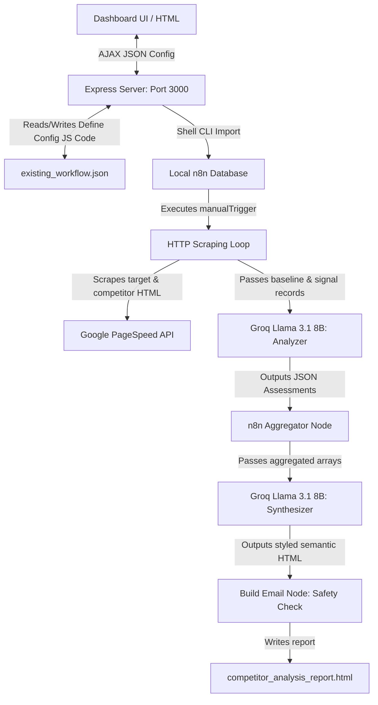

# Technical Architecture: Competitor Benchmarking Engine

This document details the system design, data flows, and component specifications of the Competitor Benchmarking and Analysis Agent.

---

## 1. System Topology

The system operates as a loop that integrates a local Express.js configuration server, a local n8n automation loop, raw HTTP scrapers, and the Groq LLM inference API.



---

## 2. Core Components

### A. Dashboard Frontend (SPA Client)
- **Role:** Interactive control interface for target company details, competitor checkboxes, and prompt tuning.
- **Stack:** Vanilla CSS + HTML5 + JavaScript (Fetch API). Renders dynamically based on `state` variables.
- **Interface Tabs:**
  - **Dashboard:** Interactive cards with checkboxes to enable/disable competitors for the scraper loop.
  - **Configuration:** Form inputs for Target Company metadata, PageSpeed API Keys, Groq API Keys, **Competitor Analyzer System Prompt**, and **Report Synthesizer System Prompt**.
  - **Extracted Signals:** Diagnostic tab to inspect the raw scraped variables (metadata, tags, and PageSpeed ratings).
  - **Report History:** Historical database of reports stored in the `reports/` folder.

### B. Dashboard Express Backend (`server.js`)
- **Role:** Data translation gateway and CLI orchestrator.
- **Endpoints:**
  - `GET /api/config`: Reads `Define Config` node from `existing_workflow.json` and parses the JavaScript code back into a JSON config object.
  - `POST /api/config`: Receives configuration edits, serializes target metadata, competitor checkbox states, and system prompts into JS code, patches the workflow JSON, and imports it to n8n database via `n8n import:workflow`.
  - `GET /api/reports`: Reads `reports/` folder on disk to index all previous HTML reports.
  - `GET /api/reports/:name`: Serves a specific archived report file.

### C. n8n Automation & Scraper Loop
- **Define Config Node:** Serves as the database of record. Holds variables (`targetCompany`, `competitors`, `analyzerSystemPrompt`, `reportSystemPrompt`, `analysisContext`, API Keys).
- **Fetch Target Baseline Node:** Captures the target company's SEO metrics, tags count, and PageSpeed baseline.
- **Split Out Competitors Node:** Code node filtering the `competitors` database to discard inactive competitor elements (those with `enabled: false`), preventing unnecessary loops.
- **Fetch Competitor Data Node:** Captures competitor SEO signals. Pauses for 15 seconds after each scrape to prevent hitting PageSpeed or target server rate limits.
- **Groq - Analyze Competitor Node:** Submits scraped competitor HTML data along with target baselines to Llama-3.1-8b-instant. Uses the custom system prompt dynamically mapped from `Define Config`.
- **Groq - Executive Report Node:** Submits aggregated individual competitor analysis records to synthesize the unified report.
- **Build Email Node:** Intercepts runs with `analyses.length === 0` (zero competitors selected) to output a friendly dashboard warning. Otherwise, compiles the final executive report and competitor deep-dives.

---

## 3. Data Model Structures

### Configuration Payload (`/api/config`)
```json
{
  "targetCompany": {
    "name": "vidaXL",
    "homepage": "https://www.vidaxl.nl",
    "blog": "https://www.vidaxl.nl/blog",
    "socials": {
      "instagram": "https://www.instagram.com/vidaxl/",
      "facebook": "https://www.facebook.com/vidaXL/",
      "linkedin": "https://www.linkedin.com/company/vidaxl/"
    }
  },
  "competitors": [
    {
      "name": "Wayfair",
      "homepage": "https://www.wayfair.de",
      "blog": "https://www.wayfair.de/ideas-and-advice",
      "instagram": "https://www.instagram.com/wayfair/",
      "enabled": true
    },
    {
      "name": "IKEA",
      "homepage": "https://www.ikea.com/nl/nl/",
      "blog": "https://www.ikea.com/nl/nl/ideas/",
      "instagram": "https://www.instagram.com/ikea/",
      "enabled": true
    }
  ],
  "analysisContext": "PR1 Navigate & Search program milestones...",
  "analyzerSystemPrompt": "You are a senior e-commerce CRO...",
  "reportSystemPrompt": "You are preparing an executive competitor analysis...",
  "groqApiKey": "gsk_...",
  "pagespeedApiKey": ""
}
```

---

## 4. Analysis and Report Generation Pipeline

```
1. Client clicks "Run Analysis Scraper" on UI.
2. CLI runs $env:N8N_RUNNERS_BROKER_PORT=5699; n8n execute --id=P4bBNPzkRmQCXVHl.
3. Target baseline metrics are fetched.
4. Active competitors list is iterated sequentially.
5. Llama 3.1 8B analyses competitor signals against target baseline signals.
6. Aggregated results are compiled by the Synthesizer node into structured HTML.
7. Safety validation check validates loop length.
8. Output report is written to disk.
```

---

## 5. Security & Rate-Limit Controls

1. **Sequential Loop Batching:** n8n HTTP Request loop execution uses a batch size of `1` with a delay buffer of `15000ms` between items. This ensures the scraping process does not get blocked by Google PageSpeed or target CDN firewalls.
2. **Strict LLM Synthesis Filters:** The synthesizer user prompt explicitly locks comparisons to the analyzed competitors list, eliminating hallucinations of random brands (e.g. Amazon, eBay) in generated summary tables.
3. **Empty Selection Safeguard:** Bypasses LLM inference completely when zero competitors are checked to prevent layout errors, returning a warning view.
