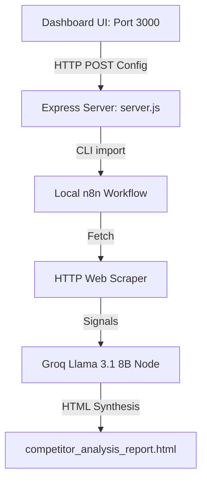

# Competitor Analysis Agent Context

This document compiles the architecture, file layout, dashboard features, workflow logic, and operating instructions for the Competitor Benchmarking and Analysis Agent.

---

## 1. Architecture Overview

The system is a generic competitor benchmarking engine designed to analyze any target company against a customizable list of competitors across User Experience (UX/layout design), SEO/blog quality, and social media presence.



---

## 2. Key Project Files & Folders

- **[server.js](file:///c:/Users/aishw/Documents/Competitor%20analysis%20agent/server.js):** Express.js backend running on `localhost:3000`. Manages reading configuration parameters from n8n, saving edits back to n8n, triggering runs, and scanning report history.
- **[public/](file:///c:/Users/aishw/Documents/Competitor%20analysis%20agent/public/):** Web assets for the config and reporting interface:
  - `index.html`: Modern layout with glassmorphism styling, tabs, interactive checkboxes, and prompt editors.
  - `index.js`: State management, form submission, and event handlers.
  - `style.css`: Visual styling tokens, card borders, and animations.
- **[existing_workflow.json](file:///c:/Users/aishw/Documents/Competitor%20analysis%20agent/existing_workflow.json):** The JSON schema definition of the n8n workflow.
- **[competitor_analysis_report.html](file:///c:/Users/aishw/Documents/Competitor%20analysis%20agent/competitor_analysis_report.html):** The latest compiled HTML analysis report.
- **[reports/](file:///c:/Users/aishw/Documents/Competitor%20analysis%20agent/reports/):** Directory containing timestamped archived copies of historical reports.
- **[scratch/update_workflow.js](file:///C:/Users/aishw/.gemini/antigravity-ide/scratch/update_workflow.js):** Utility script that reads `existing_workflow.json`, patches nodes, and writes updates back.
- **[scratch/extract_report.js](file:///C:/Users/aishw/.gemini/antigravity-ide/scratch/extract_report.js):** Utility script that reads the n8n execution log to extract compiled HTML.
- **n8n Editor UI:** The workflow is running locally and can be accessed visually in the web browser at [http://localhost:5678](http://localhost:5678) (Workflow: *vidaXL Competitor Analysis Workflow*, ID: `P4bBNPzkRmQCXVHl`).

---

## 3. Core Dashboard UI Features

1. **Selective Competitor Benchmarking:** Renders a list of 10 competitors (Wayfair, IKEA, OTTO, Home24, OBI, JYSK, Fonq, Bauhaus, Kees Smit, ManoMano) with checkboxes. Checking or unchecking a competitor updates the database configuration in real-time.
2. **Generic Target Baseline Config:** Edit target brand name, homepage, blog, and social profile links (defaults to vidaXL).
3. **AI Prompt Editors:** Allows updating the **Competitor Analyzer System Prompt** and **Report Synthesizer System Prompt** directly in the Configuration tab.
4. **Historical Report Index:** View previous analysis runs stored in the reports folder.

---

## 4. Workflow Node Roles

1. **`Define Config` (JS Code):** Output configurations (API keys, target company details, competitor database with enabled/disabled states, and customized system prompts).
2. **`Split Out Competitors` (JS Code):** Filters the database array to process *only* checked competitors.
3. **`Fetch Target Baseline` (JS Code):** Scrapes the target website and PageSpeed metrics to capture the baseline.
4. **`Fetch Competitor Data` (JS Code):** Scrapes each checked competitor, pausing for 15 seconds to respect rate limits.
5. **`Groq - Analyze Competitor` (HTTP Request):** Analyzes layout details (density, search bar placement, menus), blog, and social presence using a customized system prompt.
6. **`Groq - Executive Report` (HTTP Request):** Synthesizes comparisons, cross-competitor patterns, and a prioritized action plan.
7. **`Build Email` (JS Code):** 
   - Compiles final HTML sections.
   - **Safety Safeguard:** If no competitors are checked, it intercepts execution and writes a warning message to the report instructing the user to check a brand.
8. **`Write Report to File` (Write Binary File):** Writes the report to disk.

---

## 5. Operations & Execution Commands

### Start Dashboard Server
```powershell
node server.js
```

### Apply Workflow Code Patches
```powershell
node C:\Users\aishw\.gemini\antigravity-ide\scratch\update_workflow.js
```

### Import Workflow JSON to n8n Database
```powershell
node C:\Users\aishw\AppData\Roaming\npm\node_modules\n8n\bin\n8n import:workflow --input=existing_workflow.json
```

### Run Scraper Analysis Workflow
```powershell
$env:N8N_RUNNERS_BROKER_PORT=5699
node C:\Users\aishw\AppData\Roaming\npm\node_modules\n8n\bin\n8n execute --id=P4bBNPzkRmQCXVHl
```

### Extract HTML Report from n8n Log
```powershell
node C:\Users\aishw\.gemini\antigravity-ide\scratch\extract_report.js
```
